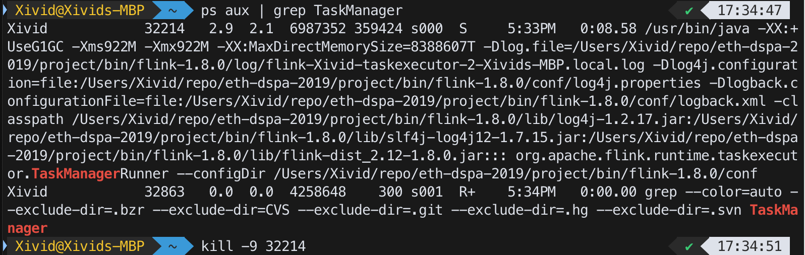
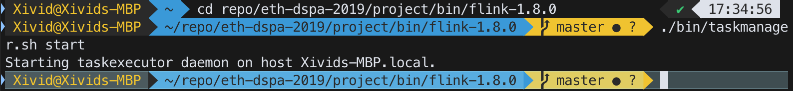
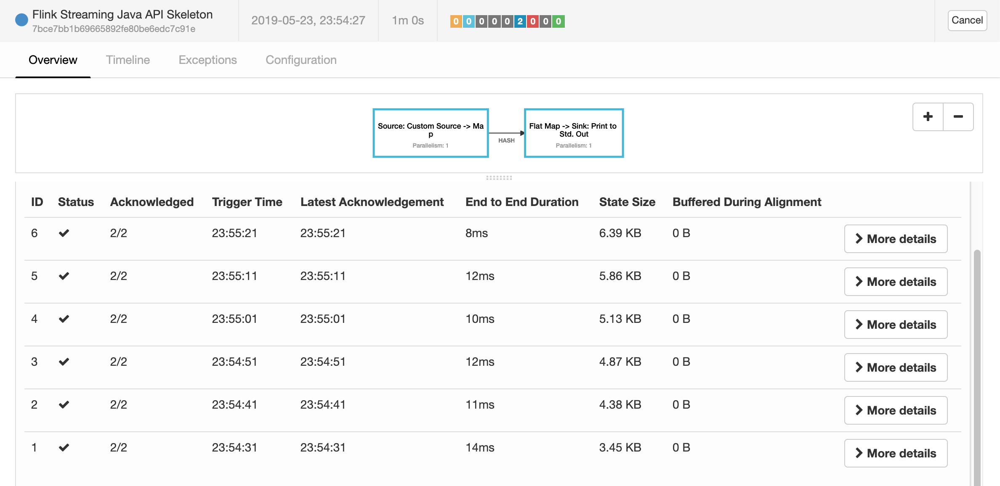
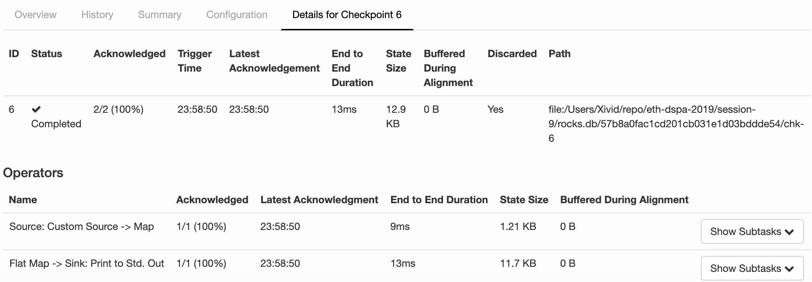
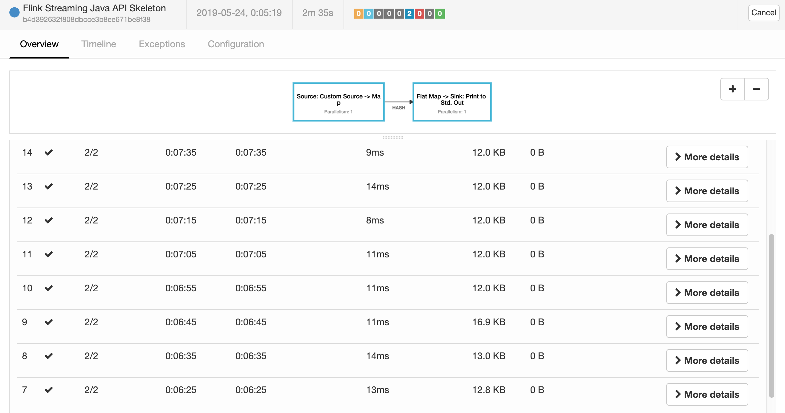

# Assignment 9

## I. Cause a failure and set a restart strategy

### Task 1
By killing the TaskManager:

The task status becomes `CREATED`, and `attempt` is incremented:

After starting a new task manager:

The status becomes `RUNNING` again, with `attempt = 2`.


### Task 2
The output is sinked to `stdout`, which is a file in Flink's `log` folder. Everytime we kill and start a new task manager, we automatically get a new output filename (named by the new task executor's id). 

By comparing the following files:
- flink-Xivid-taskexecutor-0-student-net-cx-3057.ethz.ch.out
- flink-Xivid-taskexecutor-1-student-net-cx-3057.ethz.ch.out
- flink-Xivid-taskexecutor-2-student-net-cx-3057.ethz.ch.out

The observation is that file `i+1` contains the full content of file `i` in this header, plus more new results (because the producer is always producing new data).


## II. Use managed state and checkpoints

Main function of the streaming application:
```java

public static void main(String[] args) throws Exception {
    // set up the streaming execution environment
    final StreamExecutionEnvironment env = StreamExecutionEnvironment.getExecutionEnvironment();
    RocksDBStateBackend backend = new RocksDBStateBackend("file:///Users/Xivid/repo/eth-dspa-2019/session-9/rocks.db", true);
    env.setStateBackend(backend);
    // Set a fixed delay restart strategy with a maximum of 5 restart attempts
    // and a 1s interval between retries
    env.setRestartStrategy(RestartStrategies.fixedDelayRestart(5, 1000));

    // Take a checkpoint every 10s
    env.enableCheckpointing(10000);

    Properties kafkaProps = new Properties();
    kafkaProps.setProperty("zookeeper.connect", "localhost:2181");
    kafkaProps.setProperty("bootstrap.servers", "localhost:9092");
    kafkaProps.setProperty("group.id", "test-consumer-group");
    kafkaProps.setProperty("enable.auto.commit", "false");
    // always read the Kafka topic from the start
    kafkaProps.setProperty("auto.offset.reset", "earliest");
    DataStream<Tuple2<String, Integer>> edits = env
            .addSource(new FlinkKafkaConsumer011<>("wiki-edits",
                    new CustomDeserializationSchema(), kafkaProps))
            .setParallelism(1)
            .map(new MapFunction<WikipediaEditEvent, Tuple2<String, Integer>>() {
                @Override
                public Tuple2<String, Integer> map(WikipediaEditEvent event) {
                    return new Tuple2<>(
                            event.getUser(), event.getByteDiff());
                }
            });

    DataStream<Tuple2<String, Integer>> results = edits
        // group by user
        .keyBy(0)
        .flatMap(new ComputeDiffs());
    results.print().setParallelism(1);

    // execute program
    env.execute("Flink Streaming Java API Skeleton");
}
```

The flat map function `ComputeDiffs`:
```java
// Keep track of user byte diffs by key
public static final class ComputeDiffs extends RichFlatMapFunction<
            Tuple2<String, Integer>, Tuple2<String, Integer>> {

    // actually it would suffice to use ValueState<Integer>, because we don't really need to store the user name (which is the key)
    private transient ValueState<Tuple2<String, Integer>> diffs;

    @Override
    public void open(Configuration parameters) throws Exception {
        ValueStateDescriptor<Tuple2<String, Integer>> descriptor =
                new ValueStateDescriptor<Tuple2<String, Integer>>(
                        "diffs",
                        TypeInformation.of(new TypeHint<Tuple2<String, Integer>>() {}),
                        Tuple2.of("", 0)
                );
        diffs = getRuntimeContext().getState(descriptor);
    }

    @Override
    public void flatMap(Tuple2<String, Integer> in,
                        Collector<Tuple2<String, Integer>> out) throws Exception {
        String user = in.f0;
        int diff = in.f1;
        Tuple2<String, Integer> currentDiff = diffs.value();

        // the key should always be the same here, so this can be eliminated ...
        currentDiff.f0 = user;
        currentDiff.f1 += diff;

        // ... and we can out.collect(new Tuple2<String, Integer> (user, new diff value))
        out.collect(currentDiff);
    }
}
```

### Task 1
Using ValueState is enough, because it is scoped to the key of the input element, which is the user name. It is also possible to use MapState, but it will be an over-kill because there will only be one key.

### Task 2
The state backend is changed to RocksDB as stated by lines 4~5 of the above code.
The checkpoints are triggered every 10 seconds. The size keeps growing, as shown in the below figure, because the state size get larger and larger. The end-to-end durations are around 10ms.



### Task 3
The size does not monotonously increase, because only changes are recorded. 



But the sizes are slightly larger than the non-incremental case, with a minimum size of 12KB when there is no new message at all (checkpoints 10~14 in the screenshot below). I assume this is the overhead for certain metadata.


## III. Re-configure the application from a savepoint

```java

	public static void main(String[] args) throws Exception {
		// set up the streaming execution environment
		final StreamExecutionEnvironment env = StreamExecutionEnvironment.getExecutionEnvironment();
        RocksDBStateBackend backend = new RocksDBStateBackend("file:///Users/Xivid/repo/eth-dspa-2019/session-9/rocks.db", true);
        env.setStateBackend(backend);
		// Set a fixed delay restart strategy with a maximum of 5 restart attempts
		// and a 1s interval between retries
		env.setRestartStrategy(RestartStrategies.fixedDelayRestart(5, 1000));

		// Take a checkpoint every 10s
		env.enableCheckpointing(10000);

		Properties kafkaProps = new Properties();
		kafkaProps.setProperty("zookeeper.connect", "localhost:2181");
		kafkaProps.setProperty("bootstrap.servers", "localhost:9092");
		kafkaProps.setProperty("group.id", "test-consumer-group");
		kafkaProps.setProperty("enable.auto.commit", "false");
		// always read the Kafka topic from the start
		kafkaProps.setProperty("auto.offset.reset", "earliest");
		DataStream<Tuple2<String, Integer>> edits = env
				.addSource(new FlinkKafkaConsumer011<>("wiki-edits",
						new CustomDeserializationSchema(), kafkaProps))
				.setParallelism(1)
				.map(new MapFunction<WikipediaEditEvent, Tuple2<String, Integer>>() {
					@Override
					public Tuple2<String, Integer> map(WikipediaEditEvent event) {
						return new Tuple2<>(
								event.getUser(), event.getByteDiff());
					}
				});

		DataStream<Tuple2<String, Double>> results = edits
			// group by user
			.keyBy(0)
			.flatMap(new ComputeDiffs()).setParallelism(2);
		results.print().setParallelism(1);

		// execute program
		env.execute("Flink Streaming Java API Skeleton");
	}

	// Keep track of user byte diffs in a HashMap
	public static final class ComputeDiffs extends RichFlatMapFunction<
				Tuple2<String, Integer>, Tuple2<String, Double>> {

		// user -> diffs
        private transient ValueState<Tuple2<String, Integer>> diffs;

		@Override
		public void open(Configuration parameters) throws Exception {
            ValueStateDescriptor<Tuple2<String, Integer>> descriptor =
                    new ValueStateDescriptor<Tuple2<String, Integer>>(
                            "diffs",
                            TypeInformation.of(new TypeHint<Tuple2<String, Integer>>() {}),
                            Tuple2.of("", 0)
                    );
            diffs = getRuntimeContext().getState(descriptor);
		}

		@Override
		public void flatMap(Tuple2<String, Integer> in,
							Collector<Tuple2<String, Double>> out) throws Exception {
			String user = in.f0;
			int diff = in.f1;
            Tuple2<String, Integer> currentDiff = diffs.value();

            currentDiff.f0 = user;
            currentDiff.f1 += diff;

			out.collect(new Tuple2<String, Double>(currentDiff.f0, currentDiff.f1 / 1024.0));
		}
	}
```

### Task 1
(add screenshot)


### Task 2
The counters are correctly printed in KB, including those restored from the savepoint!